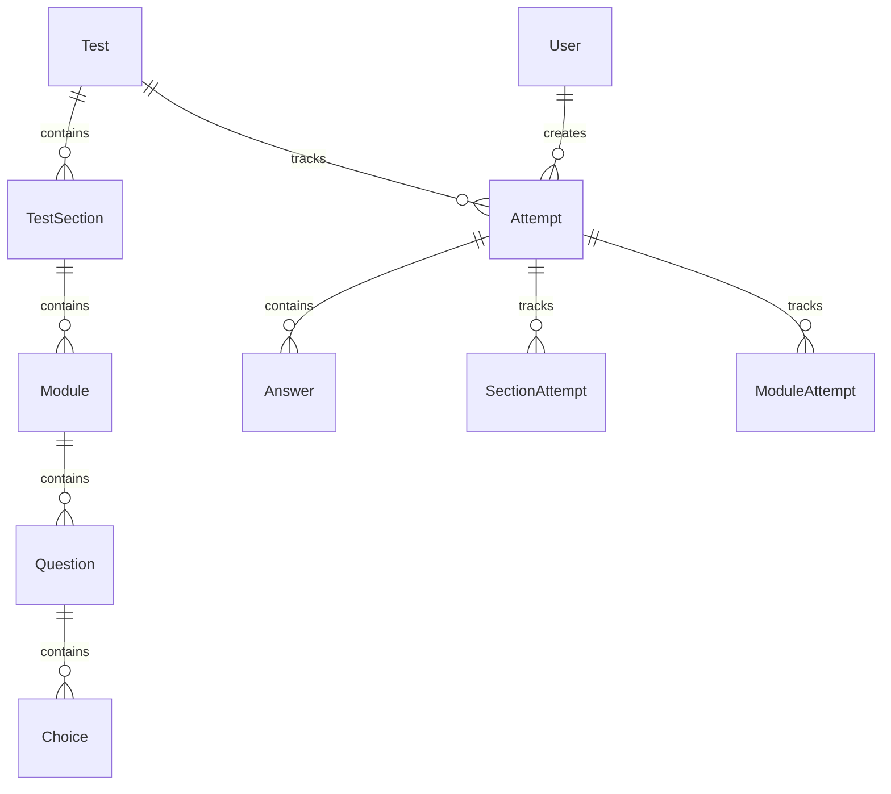
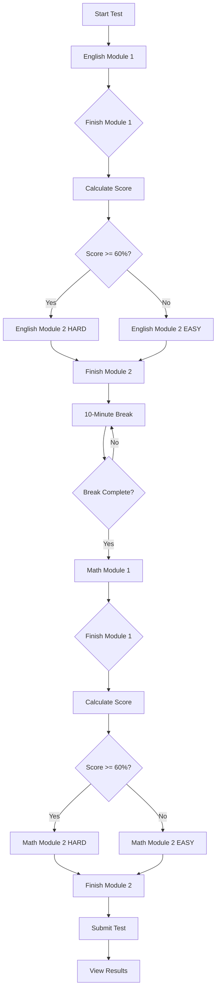
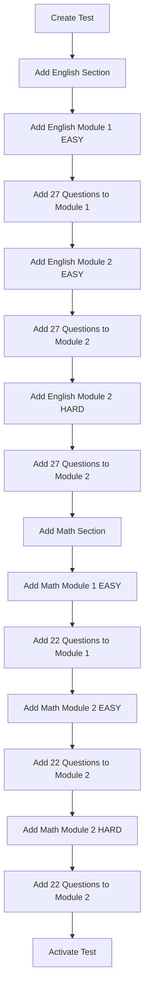

# Digital SAT Test System Documentation

## Overview

This document describes the complete Digital SAT practice test system implementation. The system follows the official Digital SAT format with adaptive testing, section-based structure, and timed breaks.

## Table of Contents

1. [Architecture Overview](#architecture-overview)
2. [Database Schema](#database-schema)
3. [API Endpoints](#api-endpoints)
4. [Test Flow](#test-flow)
5. [Adaptive Logic](#adaptive-logic)
6. [Security Features](#security-features)
7. [Frontend Integration Guide](#frontend-integration-guide)
8. [Example Requests](#example-requests)

---

## Architecture Overview

### Test Structure

```
Test
├── Section (ENGLISH - Reading & Writing)
│   ├── Module 1 (27 questions, EASY difficulty)
│   └── Module 2 (27 questions, EASY or HARD - adaptive)
├── 10-minute Break
└── Section (MATH)
    ├── Module 1 (22 questions, EASY difficulty)
    └── Module 2 (22 questions, EASY or HARD - adaptive)
```

### Key Features

- ✅ **Adaptive Testing**: Module 2 difficulty based on Module 1 performance
- ✅ **Timed Breaks**: 10-minute mandatory break between sections
- ✅ **Progress Tracking**: Real-time tracking of section/module/question progress
- ✅ **Security**: Backend-only scoring, no answer exposure during test
- ✅ **Resume Capability**: Students can resume incomplete tests

---

## Database Schema

### Core Models

#### Test
```typescript
{
  id: string (UUID)
  title: string
  description?: string
  isActive: boolean
  sections: TestSection[]
  createdAt: DateTime
  updatedAt: DateTime
}
```

#### TestSection
```typescript
{
  id: string (UUID)
  testId: string
  sectionType: 'ENGLISH' | 'MATH'
  orderIndex: number // 0 = English, 1 = Math
  duration: number // in minutes
  allowCalculator: boolean
  breakDurationAfter: number // in minutes (10 for English)
  modules: Module[]
}
```

#### Module
```typescript
{
  id: string (UUID)
  sectionId: string
  moduleNumber: 1 | 2
  difficulty: 'EASY' | 'HARD'
  questionCount: number // 27 for English, 22 for Math
  duration: number // in minutes
  questions: Question[]
}
```

#### Question
```typescript
{
  id: string (UUID)
  moduleId: string
  questionText: string
  orderIndex: number
  difficulty: 'EASY' | 'MEDIUM' | 'HARD'
  choices: Choice[]
}
```

#### Choice
```typescript
{
  id: string (UUID)
  questionId: string
  choiceText: string
  isCorrect: boolean // NEVER sent to frontend before submission
  orderIndex: number
}
```

#### Attempt
```typescript
{
  id: string (UUID)
  userId: string
  testId: string
  status: 'IN_PROGRESS' | 'COMPLETED' | 'ABANDONED'
  currentSectionId?: string
  currentModuleId?: string
  currentQuestionIndex: number
  breakStatus: 'NOT_STARTED' | 'IN_PROGRESS' | 'COMPLETED'
  breakStartedAt?: DateTime
  breakEndsAt?: DateTime
  totalScore?: number
  startedAt: DateTime
  completedAt?: DateTime
}
```

#### SectionAttempt
```typescript
{
  id: string (UUID)
  attemptId: string
  sectionId: string
  status: 'IN_PROGRESS' | 'COMPLETED' | 'ABANDONED'
  score?: number
  startedAt: DateTime
  completedAt?: DateTime
}
```

#### ModuleAttempt
```typescript
{
  id: string (UUID)
  attemptId: string
  moduleId: string
  status: 'IN_PROGRESS' | 'COMPLETED' | 'ABANDONED'
  score?: number
  correctCount: number // For adaptive selection
  totalCount: number
  startedAt: DateTime
  completedAt?: DateTime
}
```

### Entity Relationships



---

## API Endpoints

### Admin Endpoints (Requires ADMIN role)

#### Test Management

**Create Test**
```http
POST /tests
Authorization: Bearer {jwt_token}
Content-Type: application/json

{
  "title": "SAT Practice Test 1",
  "description": "Full-length Digital SAT practice test",
  "sections": [
    {
      "sectionType": "ENGLISH",
      "orderIndex": 0,
      "duration": 64,
      "allowCalculator": false,
      "breakDurationAfter": 10,
      "modules": [
        {
          "moduleNumber": 1,
          "difficulty": "EASY",
          "questionCount": 27,
          "duration": 32,
          "questions": [...]
        },
        {
          "moduleNumber": 2,
          "difficulty": "HARD",
          "questionCount": 27,
          "duration": 32,
          "questions": [...]
        }
      ]
    },
    {
      "sectionType": "MATH",
      "orderIndex": 1,
      "duration": 70,
      "allowCalculator": true,
      "breakDurationAfter": 0,
      "modules": [...]
    }
  ]
}
```

**Get All Tests**
```http
GET /tests
Authorization: Bearer {jwt_token}
```

**Get Test by ID**
```http
GET /tests/{testId}
Authorization: Bearer {jwt_token}
```

**Update Test**
```http
PATCH /tests/{testId}
Authorization: Bearer {jwt_token}
Content-Type: application/json

{
  "title": "Updated Test Title",
  "isActive": true
}
```

**Delete Test (Soft Delete)**
```http
DELETE /tests/{testId}
Authorization: Bearer {jwt_token}
```

#### Question Management

**Add Question to Module**
```http
POST /tests/modules/{moduleId}/questions
Authorization: Bearer {jwt_token}
Content-Type: application/json

{
  "questionText": "What is 2 + 2?",
  "orderIndex": 0,
  "difficulty": "EASY",
  "choices": [
    { "choiceText": "3", "isCorrect": false, "orderIndex": 0 },
    { "choiceText": "4", "isCorrect": true, "orderIndex": 1 },
    { "choiceText": "5", "isCorrect": false, "orderIndex": 2 }
  ]
}
```

**Update Question**
```http
PATCH /tests/modules/{moduleId}/questions/{questionId}
Authorization: Bearer {jwt_token}
Content-Type: application/json
```

**Delete Question**
```http
DELETE /tests/modules/{moduleId}/questions/{questionId}
Authorization: Bearer {jwt_token}
```

---

### Student Practice Endpoints (Requires authentication)

#### Test Discovery

**Get Available Tests**
```http
GET /practice/tests
Authorization: Bearer {jwt_token}
```

Response:
```json
[
  {
    "id": "uuid",
    "title": "SAT Practice Test 1",
    "description": "Full-length Digital SAT practice test",
    "totalDuration": 144,
    "totalQuestions": 98,
    "sections": [
      {
        "type": "ENGLISH",
        "duration": 64,
        "moduleCount": 2,
        "allowCalculator": false
      },
      {
        "type": "MATH",
        "duration": 70,
        "moduleCount": 2,
        "allowCalculator": true
      }
    ]
  }
]
```

**Get My Attempts**
```http
GET /practice/my-attempts?testId={testId}
Authorization: Bearer {jwt_token}
```

#### Test Attempt Flow

**1. Start/Resume Test**
```http
POST /practice/start/{testId}
Authorization: Bearer {jwt_token}
```

Response:
```json
{
  "attemptId": "uuid",
  "testTitle": "SAT Practice Test 1",
  "currentSection": {
    "id": "uuid",
    "type": "ENGLISH",
    "orderIndex": 0,
    "duration": 64,
    "allowCalculator": false
  },
  "currentModule": {
    "id": "uuid",
    "moduleNumber": 1,
    "duration": 32,
    "totalQuestions": 27
  },
  "currentQuestionIndex": 0,
  "question": {
    "id": "uuid",
    "questionText": "What is...",
    "choices": [
      { "id": "uuid", "choiceText": "Option A", "orderIndex": 0 },
      { "id": "uuid", "choiceText": "Option B", "orderIndex": 1 }
    ]
  },
  "breakStatus": "NOT_STARTED"
}
```

**2. Get Current Question**
```http
GET /practice/attempts/{attemptId}/current
Authorization: Bearer {jwt_token}
```

**3. Submit Answer**
```http
POST /practice/attempts/{attemptId}/answer
Authorization: Bearer {jwt_token}
Content-Type: application/json

{
  "questionId": "uuid",
  "choiceId": "uuid"
}
```

Response:
```json
{
  "success": true,
  "answeredAt": "2024-01-15T10:30:00Z"
}
```
⚠️ **Note**: Does NOT return if answer is correct!

**4. Navigate Questions**
```http
POST /practice/attempts/{attemptId}/next
POST /practice/attempts/{attemptId}/previous
POST /practice/attempts/{attemptId}/goto/{questionIndex}
Authorization: Bearer {jwt_token}
```

**5. Finish Module**
```http
POST /practice/attempts/{attemptId}/finish-module
Authorization: Bearer {jwt_token}
```

Response (Module 1 → Module 2):
```json
{
  "message": "Module 1 completed. Starting Module 2.",
  "module1Score": 85,
  "module2Difficulty": "HARD",
  "nextStep": "MODULE_2"
}
```

Response (Module 2 → Break):
```json
{
  "message": "Section completed. Break started.",
  "breakDuration": 10,
  "breakEndsAt": "2024-01-15T10:40:00Z",
  "nextStep": "BREAK"
}
```

Response (Module 2 Math → End):
```json
{
  "message": "All sections completed. You can now submit the test.",
  "nextStep": "SUBMIT_TEST"
}
```

**6. Check Break Status**
```http
GET /practice/attempts/{attemptId}/break-status
Authorization: Bearer {jwt_token}
```

Response (During Break):
```json
{
  "breakStatus": "IN_PROGRESS",
  "breakEndsAt": "2024-01-15T10:40:00Z",
  "remainingSeconds": 420,
  "message": "Break is still in progress"
}
```

Response (Break Complete):
```json
{
  "message": "Starting MATH section",
  "nextStep": "NEW_SECTION",
  "section": {
    "id": "uuid",
    "type": "MATH",
    "allowCalculator": true
  }
}
```

**7. Submit Test**
```http
POST /practice/attempts/{attemptId}/submit
Authorization: Bearer {jwt_token}
```

Response:
```json
{
  "totalScore": 85,
  "totalQuestions": 98,
  "correctAnswers": 83,
  "wrongAnswers": 15,
  "completedAt": "2024-01-15T11:00:00Z",
  "sections": [
    {
      "sectionType": "ENGLISH",
      "score": 88,
      "modules": [
        {
          "moduleNumber": 1,
          "difficulty": "EASY",
          "score": 90,
          "correctCount": 24,
          "totalCount": 27,
          "questions": [
            {
              "questionId": "uuid",
              "questionText": "What is...",
              "difficulty": "EASY",
              "userChoiceId": "uuid",
              "correctChoiceId": "uuid",
              "isCorrect": true,
              "choices": [...]
            }
          ]
        },
        {
          "moduleNumber": 2,
          "difficulty": "HARD",
          "score": 86,
          "correctCount": 23,
          "totalCount": 27,
          "questions": [...]
        }
      ]
    },
    {
      "sectionType": "MATH",
      "score": 82,
      "modules": [...]
    }
  ]
}
```

**8. Get Results (For Completed Attempt)**
```http
GET /practice/attempts/{attemptId}/results
Authorization: Bearer {jwt_token}
```

**9. Abandon Attempt**
```http
POST /practice/attempts/{attemptId}/abandon
Authorization: Bearer {jwt_token}
```

---

## Test Flow

### Student Experience Flow



### Admin Flow



---

## Adaptive Logic

### Module 2 Selection Algorithm

```typescript
function selectModule2Difficulty(module1Correct: number, module1Total: number): ModuleDifficulty {
  const percentage = (module1Correct / module1Total) * 100;

  if (percentage >= 60) {
    return 'HARD';
  } else {
    return 'EASY';
  }
}
```

### Implementation Details

1. **Module 1 Completion**:
   - Backend calculates correct answers
   - Stores `correctCount` in `ModuleAttempt`
   - Percentage = (correctCount / totalCount) × 100

2. **Module 2 Selection**:
   - If percentage ≥ 60% → Select HARD Module 2
   - If percentage < 60% → Select EASY Module 2
   - Fallback: If target difficulty unavailable, use any Module 2

3. **Transparency**:
   - Backend returns selected difficulty in response
   - Frontend can display: "Based on your performance, you'll receive [EASY/HARD] questions"

### Example Scenarios

| Module 1 Score | Percentage | Module 2 Difficulty |
|---------------|------------|---------------------|
| 24/27         | 88.9%      | HARD                |
| 18/27         | 66.7%      | HARD                |
| 16/27         | 59.3%      | EASY                |
| 10/27         | 37.0%      | EASY                |

---

## Security Features

### 1. Answer Security

**Problem**: Prevent students from viewing correct answers during test

**Solution**:
- `isCorrect` flag stored in database
- **NEVER** included in API responses during test
- Only revealed after `POST /practice/attempts/:id/submit`

**Implementation**:
```typescript
// During test - Choice response (SECURE)
{
  id: "uuid",
  choiceText: "Paris",
  orderIndex: 1
  // isCorrect: OMITTED
}

// After submission - Choice response
{
  id: "uuid",
  choiceText: "Paris",
  orderIndex: 1,
  isCorrect: true // NOW INCLUDED
}
```

### 2. Backend Scoring

**All scoring calculations happen on server**:
- Module scores calculated in `finishModule()`
- Total scores calculated in `submitTest()`
- No score data sent to frontend until submission

### 3. User Ownership Validation

**Every endpoint checks**:
```typescript
if (attempt.userId !== req.user.id) {
  throw new ForbiddenException('You do not have access to this attempt');
}
```

### 4. Status Validation

**Prevents invalid operations**:
- Can't submit answer for COMPLETED attempt
- Can't navigate during BREAK
- Can't get results for IN_PROGRESS attempt

### 5. Data Integrity

**Prisma ensures**:
- Parameterized queries (SQL injection safe)
- Type safety
- Foreign key constraints
- Cascade deletes

---

## Frontend Integration Guide

### 1. Setup

**Install Dependencies**:
```bash
npm install axios
```

**Configure API Client**:
```typescript
import axios from 'axios';

const api = axios.create({
  baseURL: 'http://localhost:3000',
  headers: {
    'Content-Type': 'application/json'
  }
});

// Add JWT token to requests
api.interceptors.request.use(config => {
  const token = localStorage.getItem('jwt_token');
  if (token) {
    config.headers.Authorization = `Bearer ${token}`;
  }
  return config;
});
```

### 2. Test Selection Page

```typescript
// Fetch available tests
const { data: tests } = await api.get('/practice/tests');

// Display tests
tests.forEach(test => {
  console.log(test.title);
  console.log(`Duration: ${test.totalDuration} minutes`);
  console.log(`Questions: ${test.totalQuestions}`);
  console.log(`Sections: ${test.sections.length}`);
});
```

### 3. Start Test

```typescript
async function startTest(testId: string) {
  try {
    const { data } = await api.post(`/practice/start/${testId}`);

    // Store attempt ID
    localStorage.setItem('attemptId', data.attemptId);

    // Start timer for module
    startTimer(data.currentModule.duration * 60); // Convert to seconds

    // Display first question
    displayQuestion(data.question);

    // Show calculator if allowed
    if (data.currentSection.allowCalculator) {
      showDesmos();
    }
  } catch (error) {
    console.error('Failed to start test:', error);
  }
}
```

### 4. Question Navigation

```typescript
async function nextQuestion() {
  const attemptId = localStorage.getItem('attemptId');
  const { data } = await api.post(`/practice/attempts/${attemptId}/next`);
  displayQuestion(data.question);
}

async function previousQuestion() {
  const attemptId = localStorage.getItem('attemptId');
  const { data } = await api.post(`/practice/attempts/${attemptId}/previous`);
  displayQuestion(data.question);
}

async function jumpToQuestion(index: number) {
  const attemptId = localStorage.getItem('attemptId');
  const { data } = await api.post(`/practice/attempts/${attemptId}/goto/${index}`);
  displayQuestion(data.question);
}
```

### 5. Submit Answer

```typescript
async function submitAnswer(questionId: string, choiceId: string) {
  const attemptId = localStorage.getItem('attemptId');

  try {
    await api.post(`/practice/attempts/${attemptId}/answer`, {
      questionId,
      choiceId
    });

    // Mark question as answered in UI
    markQuestionAnswered(questionId);

    // DO NOT show if answer is correct!
    // Backend doesn't return this information
  } catch (error) {
    console.error('Failed to submit answer:', error);
  }
}
```

### 6. Finish Module

```typescript
async function finishModule() {
  const attemptId = localStorage.getItem('attemptId');

  try {
    const { data } = await api.post(`/practice/attempts/${attemptId}/finish-module`);

    switch (data.nextStep) {
      case 'MODULE_2':
        showMessage(`Module 1 Score: ${data.module1Score}%`);
        showMessage(`Starting Module 2 (${data.module2Difficulty})`);
        // Load Module 2 questions
        await loadNextModule();
        break;

      case 'BREAK':
        showBreakScreen(data.breakEndsAt);
        startBreakTimer(data.breakDuration * 60);
        break;

      case 'SUBMIT_TEST':
        showSubmitButton();
        break;
    }
  } catch (error) {
    console.error('Failed to finish module:', error);
  }
}
```

### 7. Break Management

```typescript
let breakCheckInterval: NodeJS.Timeout;

function startBreakTimer(durationSeconds: number) {
  const endTime = Date.now() + (durationSeconds * 1000);

  breakCheckInterval = setInterval(async () => {
    const remaining = Math.max(0, endTime - Date.now());
    updateBreakTimer(Math.ceil(remaining / 1000));

    if (remaining === 0) {
      clearInterval(breakCheckInterval);
      await checkBreakStatus();
    }
  }, 1000);
}

async function checkBreakStatus() {
  const attemptId = localStorage.getItem('attemptId');
  const { data } = await api.get(`/practice/attempts/${attemptId}/break-status`);

  if (data.nextStep === 'NEW_SECTION') {
    showMessage(`Starting ${data.section.type} section`);

    if (data.section.allowCalculator) {
      showDesmos();
    }

    await loadNextSection();
  }
}
```

### 8. Submit Test

```typescript
async function submitTest() {
  const attemptId = localStorage.getItem('attemptId');

  if (!confirm('Are you sure you want to submit? You cannot change answers after submission.')) {
    return;
  }

  try {
    const { data } = await api.post(`/practice/attempts/${attemptId}/submit`);

    // Navigate to results page
    showResults(data);
  } catch (error) {
    console.error('Failed to submit test:', error);
  }
}
```

### 9. Display Results

```typescript
function showResults(results: any) {
  console.log(`Total Score: ${results.totalScore}%`);
  console.log(`Correct: ${results.correctAnswers}/${results.totalQuestions}`);

  results.sections.forEach(section => {
    console.log(`\n${section.sectionType} Section: ${section.score}%`);

    section.modules.forEach(module => {
      console.log(`  Module ${module.moduleNumber} (${module.difficulty}): ${module.score}%`);
      console.log(`  Correct: ${module.correctCount}/${module.totalCount}`);

      // Show detailed question breakdown
      module.questions.forEach((q, index) => {
        const icon = q.isCorrect ? '✓' : '✗';
        console.log(`    ${icon} Question ${index + 1} (${q.difficulty})`);
      });
    });
  });
}
```

### 10. Resume Capability

```typescript
// Check for existing IN_PROGRESS attempt on page load
async function checkExistingAttempt() {
  try {
    const { data: attempts } = await api.get('/practice/my-attempts');

    const inProgress = attempts.find(a => a.status === 'IN_PROGRESS');

    if (inProgress) {
      const resume = confirm('You have an incomplete test. Resume?');
      if (resume) {
        await resumeAttempt(inProgress.id);
      }
    }
  } catch (error) {
    console.error('Failed to check attempts:', error);
  }
}

async function resumeAttempt(attemptId: string) {
  localStorage.setItem('attemptId', attemptId);
  const { data } = await api.get(`/practice/attempts/${attemptId}/current`);

  if (data.breakStatus === 'IN_PROGRESS') {
    showBreakScreen(data.breakEndsAt);
  } else {
    displayQuestion(data.question);
  }
}
```

---

## Example Requests

### Complete Test Creation (Admin)

```bash
curl -X POST http://localhost:3000/tests \
  -H "Authorization: Bearer YOUR_JWT_TOKEN" \
  -H "Content-Type: application/json" \
  -d '{
    "title": "SAT Practice Test 1",
    "description": "Full-length Digital SAT",
    "sections": [
      {
        "sectionType": "ENGLISH",
        "orderIndex": 0,
        "duration": 64,
        "allowCalculator": false,
        "breakDurationAfter": 10,
        "modules": [
          {
            "moduleNumber": 1,
            "difficulty": "EASY",
            "questionCount": 27,
            "duration": 32,
            "questions": [
              {
                "questionText": "Which choice best maintains...",
                "orderIndex": 0,
                "difficulty": "EASY",
                "choices": [
                  { "choiceText": "Option A", "isCorrect": false, "orderIndex": 0 },
                  { "choiceText": "Option B", "isCorrect": true, "orderIndex": 1 }
                ]
              }
            ]
          }
        ]
      }
    ]
  }'
```

### Complete Test Attempt (Student)

```bash
# 1. Start test
curl -X POST http://localhost:3000/practice/start/TEST_UUID \
  -H "Authorization: Bearer YOUR_JWT_TOKEN"

# 2. Submit answer
curl -X POST http://localhost:3000/practice/attempts/ATTEMPT_UUID/answer \
  -H "Authorization: Bearer YOUR_JWT_TOKEN" \
  -H "Content-Type: application/json" \
  -d '{
    "questionId": "QUESTION_UUID",
    "choiceId": "CHOICE_UUID"
  }'

# 3. Next question
curl -X POST http://localhost:3000/practice/attempts/ATTEMPT_UUID/next \
  -H "Authorization: Bearer YOUR_JWT_TOKEN"

# 4. Finish module
curl -X POST http://localhost:3000/practice/attempts/ATTEMPT_UUID/finish-module \
  -H "Authorization: Bearer YOUR_JWT_TOKEN"

# 5. Check break
curl -X GET http://localhost:3000/practice/attempts/ATTEMPT_UUID/break-status \
  -H "Authorization: Bearer YOUR_JWT_TOKEN"

# 6. Submit test
curl -X POST http://localhost:3000/practice/attempts/ATTEMPT_UUID/submit \
  -H "Authorization: Bearer YOUR_JWT_TOKEN"
```

---

## Error Handling

### Common Error Responses

**400 Bad Request**
```json
{
  "statusCode": 400,
  "message": "Invalid question index",
  "error": "Bad Request"
}
```

**401 Unauthorized**
```json
{
  "statusCode": 401,
  "message": "Unauthorized"
}
```

**403 Forbidden**
```json
{
  "statusCode": 403,
  "message": "You do not have access to this attempt",
  "error": "Forbidden"
}
```

**404 Not Found**
```json
{
  "statusCode": 404,
  "message": "Test not found",
  "error": "Not Found"
}
```

### Error Handling Best Practices

```typescript
try {
  const response = await api.post('/practice/start/test-id');
  // Handle success
} catch (error) {
  if (error.response) {
    // Server responded with error
    switch (error.response.status) {
      case 400:
        alert('Invalid request');
        break;
      case 401:
        // Redirect to login
        window.location.href = '/login';
        break;
      case 403:
        alert('Access denied');
        break;
      case 404:
        alert('Test not found');
        break;
      default:
        alert('An error occurred');
    }
  } else {
    // Network error
    alert('Network error. Please check your connection.');
  }
}
```

---

## Testing Guide

### Unit Tests

**Test Adaptive Logic**:
```typescript
describe('Adaptive Module Selection', () => {
  it('should select HARD module when score >= 60%', async () => {
    // Mock Module 1 with 18/27 correct (66.7%)
    const result = await service.finishModule(attemptId, userId);
    expect(result.module2Difficulty).toBe('HARD');
  });

  it('should select EASY module when score < 60%', async () => {
    // Mock Module 1 with 15/27 correct (55.6%)
    const result = await service.finishModule(attemptId, userId);
    expect(result.module2Difficulty).toBe('EASY');
  });
});
```

### Integration Tests

**Test Complete Flow**:
```typescript
describe('Complete SAT Test Flow', () => {
  it('should complete full test with break', async () => {
    // Start test
    const start = await request(app)
      .post('/practice/start/test-id')
      .set('Authorization', `Bearer ${token}`);

    // Answer Module 1 questions
    for (let q of module1Questions) {
      await request(app)
        .post(`/practice/attempts/${start.body.attemptId}/answer`)
        .send({ questionId: q.id, choiceId: q.correctChoice })
        .set('Authorization', `Bearer ${token}`);
    }

    // Finish Module 1
    const finish = await request(app)
      .post(`/practice/attempts/${start.body.attemptId}/finish-module`)
      .set('Authorization', `Bearer ${token}`);

    expect(finish.body.nextStep).toBe('MODULE_2');

    // Complete Module 2, break, Math sections...
    // Submit test
    // Verify results
  });
});
```

---

## Performance Considerations

### Database Optimization

1. **Indexes**: All foreign keys are indexed
2. **Pagination**: Use offset/limit for large result sets
3. **Selective Loading**: Use Prisma `select` to limit fields

### Caching Strategy

```typescript
// Cache test structure (rarely changes)
const cachedTest = await redis.get(`test:${testId}`);
if (cachedTest) {
  return JSON.parse(cachedTest);
}

const test = await prisma.test.findUnique({...});
await redis.set(`test:${testId}`, JSON.stringify(test), 'EX', 3600);
```

### Real-time Updates

Consider using WebSockets for:
- Break timer countdown
- Module completion notifications
- Real-time progress tracking

---

## Troubleshooting

### Common Issues

**Issue**: "Test has no Module 1"
- **Cause**: Test not properly structured
- **Solution**: Ensure test has sections with Module 1

**Issue**: "Cannot navigate during break"
- **Cause**: Attempting to access questions during break
- **Solution**: Check `breakStatus` before navigation

**Issue**: "Attempt not in progress"
- **Cause**: Trying to operate on completed/abandoned attempt
- **Solution**: Check `attempt.status` before operations

---

## Changelog

### Version 1.0.0 (January 2024)

**Features**:
- ✅ Complete SAT test structure with sections and modules
- ✅ Adaptive Module 2 selection based on performance
- ✅ 10-minute break management
- ✅ Comprehensive result calculation
- ✅ Admin test management
- ✅ Student practice endpoints
- ✅ Security features (backend scoring, no answer exposure)

**Database**:
- ✅ TestSection, Module models
- ✅ SectionAttempt, ModuleAttempt tracking
- ✅ Break management fields
- ✅ Question difficulty levels

**API**:
- ✅ 13 student practice endpoints
- ✅ 8 admin management endpoints
- ✅ JWT authentication
- ✅ Role-based access control

---

## Support

For questions or issues:
- Review this documentation
- Check API error messages
- Verify JWT token is valid
- Ensure database migrations are applied
- Test with Postman/curl before integrating

---

**Documentation Version**: 1.0.0
**Last Updated**: January 15, 2024
**System Version**: Backend v1.0.0
